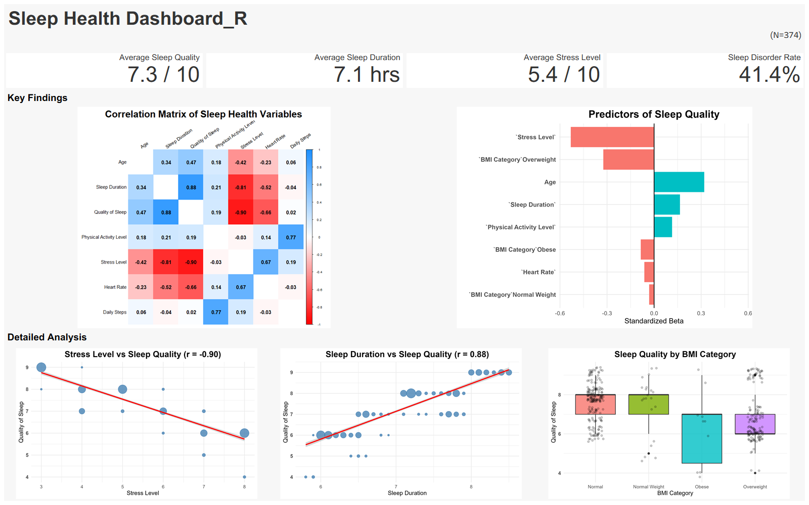

# Sleep Health Analysis

## Project Overview

This project analyzes factors affecting sleep quality using the Sleep Health and Lifestyle Dataset.

The goal is to identify key variables associated with sleep quality and visualize the findings through statistical analysis and dashboard development.

---

## Dashboard

### Dashboard Preview

---

## Objectives

* Identify the key variables that influence sleep quality.
* Analyze the relationship between sleep duration and sleep quality.
* Analyze the relationship between stress level and sleep quality.
* Examine how health indicators (BMI, heart rate, physical activity level) affect sleep quality.
* Develop a Tableau dashboard to visualize key findings.

---

## Dataset

### Source

Sleep Health and Lifestyle Dataset

https://www.kaggle.com/datasets/uom190346a/sleep-health-and-lifestyle-dataset

### Dataset Summary

| Item            | Value            |
| --------------- | ---------------- |
| Records         | 374              |
| Missing Values  | 0                |
| Target Variable | Quality of Sleep |

---

## Key Findings

### Correlation Analysis

- Sleep Duration ↔ Sleep Quality (**r = 0.88**)
- Stress Level ↔ Sleep Quality (**r = -0.90**)
- Heart Rate ↔ Sleep Quality (**r = -0.66**)

### Regression Analysis

The most influential factors affecting sleep quality were:

1. Stress Level
2. Age
3. Sleep Duration
4. Physical Activity Level

Stress Level had the strongest negative effect on sleep quality.

### BMI Analysis

* Individuals in the Obese category tended to report lower sleep quality compared with other BMI groups.

---

## Analysis Process

1. Data Cleaning and Exploration
2. Exploratory Data Analysis (EDA)
3. Correlation Analysis
4. Multiple Linear Regression
5. Variable Importance Analysis
6. Tableau Dashboard Development

---

## Tools

- Programming: R
- Visualization: Tableau, ggplot2
- Packages: tidyverse, corrplot, car, lm.beta

---
